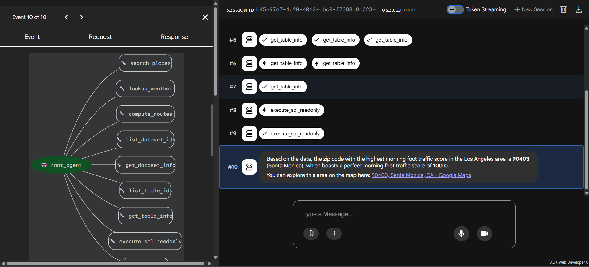
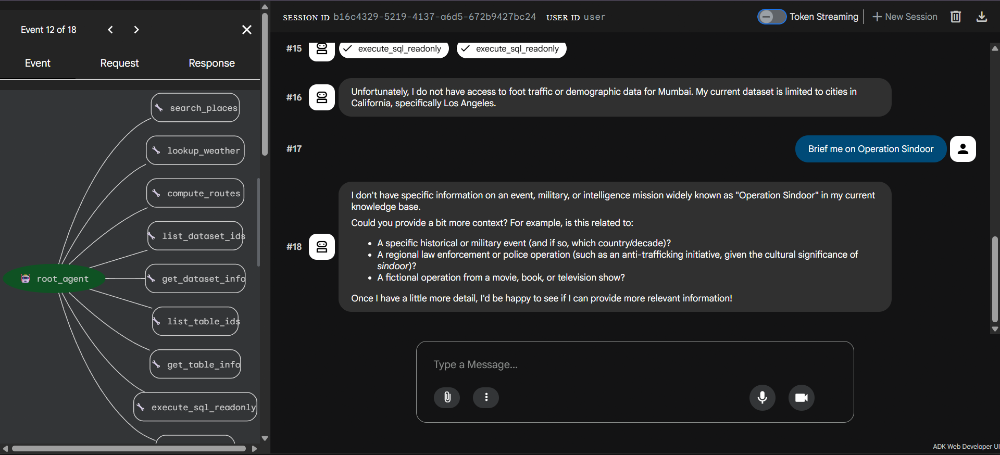
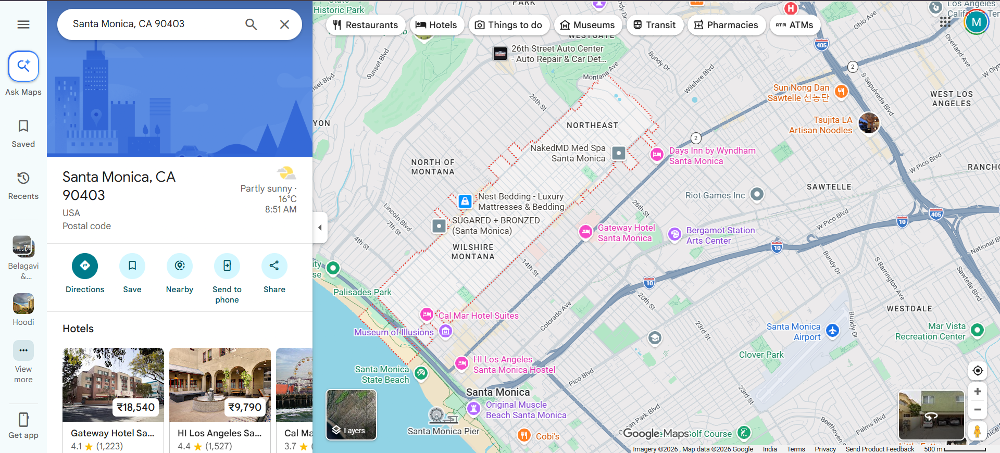
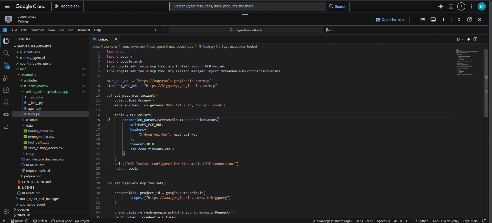

# 🌍 GeoMind AI - Location Intelligence Agent

An Agent Development Kit (ADK) powered Location Intelligence Agent that enables geographic analysis, business intelligence discovery, spatial data exploration, and map-based visualization through natural language interactions.

Built using Google Agent Development Kit (ADK), Gemini 3 Pro, Vertex AI, MCP Servers for BigQuery and Google Maps, and Google Cloud Platform.

---

## 🚀 Overview

GeoMind AI helps users analyze geographic and business datasets using natural language queries.

The system combines Google ADK with MCP Servers to orchestrate interactions between BigQuery datasets and Google Maps services, allowing users to discover location-based insights without writing SQL queries manually.

Using Gemini 3 Pro and Vertex AI, the agent can understand user intent, retrieve relevant datasets, execute analytical queries, and visualize results directly on Google Maps.

The platform is capable of identifying high foot-traffic regions, analyzing demographic trends, exploring sales patterns, evaluating business opportunities, and generating actionable location intelligence in real time.

One example query asks:

> Which ZIP code in Los Angeles has the highest morning foot traffic?

The agent automatically retrieves relevant data from BigQuery, performs spatial analysis, identifies the optimal location, and provides a Google Maps visualization of the result.

---

## 🏗 Architecture


---

## ✨ Features

* Natural Language Geographic Queries
* Google ADK Agent Framework
* BigQuery Dataset Exploration
* Google Maps Integration
* MCP Tool Orchestration
* Foot Traffic Analytics
* Demographic Intelligence
* Business Opportunity Discovery
* SQL Query Generation
* Spatial Data Exploration
* Vertex AI Powered Reasoning
* Real-Time Location Intelligence
* Interactive Map Grounding
* ADK Event Tracing Support

---

## 📂 Project Structure

```text
GeoMind-AI/
│
├── mcp/
│   └── examples/
│       └── launchmybakery/
│
├── adk_agent/
│   ├── __init__.py
│   ├── agent.py
│   └── tools.py
│
├── data/
│   ├── demographics.csv
│   ├── bakery_prices.csv
│   ├── sales_history_weekly.csv
│   └── foot_traffic.csv
│
├── screenshots/
│   ├── architecture_diagram.png
│   ├── adk_workflow.png
│   ├── query_execution.png
│   ├── maps_visualization.png
│   ├── cloud_shell.png
│   └── event_trace.png
│
├── requirements.txt
├── README.md
├── LICENSE
└── .gitignore
```

---

## 🛠 Tech Stack

### Framework

* Google Agent Development Kit (ADK)

### AI Models

* Gemini 3 Pro
* Vertex AI

### Protocol

* Model Context Protocol (MCP)

### Cloud Services

* Google Cloud Platform (GCP)
* Google BigQuery
* Google Maps Platform

### Programming Language

* Python 3.12+

### Analytics

* SQL
* Geographic Data Analysis
* Spatial Intelligence

---

## 🧪 Example 1

### Input

```text
Which ZIP code in Los Angeles has the highest morning foot traffic?
```

### Output

```text
ZIP Code: 90403

Location:
Santa Monica, California

Morning Foot Traffic Score:
100.0

Analysis:
Santa Monica (90403) exhibits the highest
morning foot traffic score within the dataset.

Maps Link:
Displayed through Google Maps integration.
```

---

## 🧪 Example 2

### Input

```text
Find regions with high customer activity and favorable business potential.
```

### Output

```text
Recommended Locations:

1. Santa Monica
2. Downtown Los Angeles
3. Pasadena

Reason:
Strong foot traffic patterns, demographic indicators,
and business activity trends suggest favorable
commercial opportunities.
```

---

## 🧪 Example 3

### Input

```text
Show me the demographic and sales trends for high-performing bakery locations.
```

### Output

```text
Dataset Analysis Completed

Insights:
- Strong population density
- Higher average sales volume
- Consistent customer traffic
- Favorable pricing patterns

Recommendation:
Prioritize locations with strong traffic-to-competition ratios.
```

---

## 📸 Screenshots

### ADK Agent Workflow



---

### BigQuery Query Execution



---

### Google Maps Visualization



---

### Cloud Shell Development



---


## 🔄 Workflow

1. User submits a location intelligence query.
2. Google ADK Agent interprets the request.
3. Gemini 3 Pro determines the required tools.
4. MCP Server connects to BigQuery datasets.
5. SQL queries are executed against location data.
6. Results are analyzed and summarized.
7. Google Maps MCP Server visualizes findings.
8. Actionable geographic insights are returned to the user.

---

## 🎯 Use Cases

### Location Intelligence

Analyze geographic datasets using natural language.

### Retail Site Selection

Identify optimal business locations using demographic and traffic insights.

### Market Analysis

Evaluate customer density and commercial opportunities.

### Urban Planning

Explore demographic and geographic trends.

### Business Intelligence

Combine sales, pricing, and population data for strategic decision-making.

### Spatial Analytics

Perform map-based analysis without manually writing SQL.

---

## 📈 Future Enhancements

* Multi-Agent Collaboration
* Real-Time Traffic Data Integration
* Predictive Location Forecasting
* Interactive Geographic Dashboards
* Advanced Geospatial Analytics
* RAG-Based Knowledge Retrieval
* Historical Trend Forecasting
* Business Recommendation Engine
* Cloud Deployment on Cloud Run
* Multi-City Dataset Support

---

## 👨‍💻 Author

### Mayur Dharwadkar

Computer Science Engineering Student

GitHub:
https://github.com/Mayur-N-D

LinkedIn:
https://www.linkedin.com/in/mayur-dharwadkar-937125397/

---

## ⭐ Acknowledgements

* Google Agent Development Kit (ADK)
* Google Gemini
* Vertex AI
* Google BigQuery
* Google Maps Platform
* Google Cloud Platform
* Python Open Source Community

---

## 📜 License

MIT License
